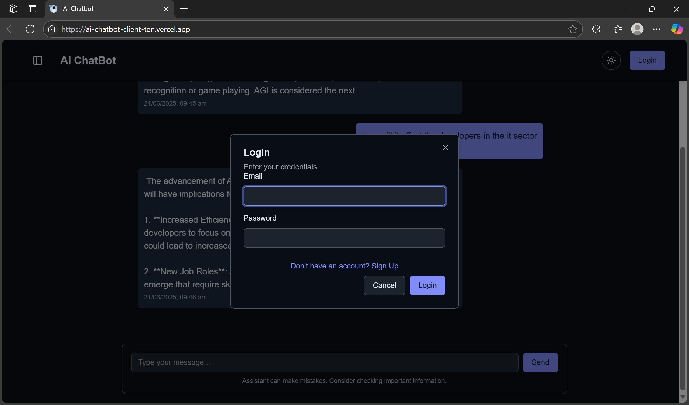
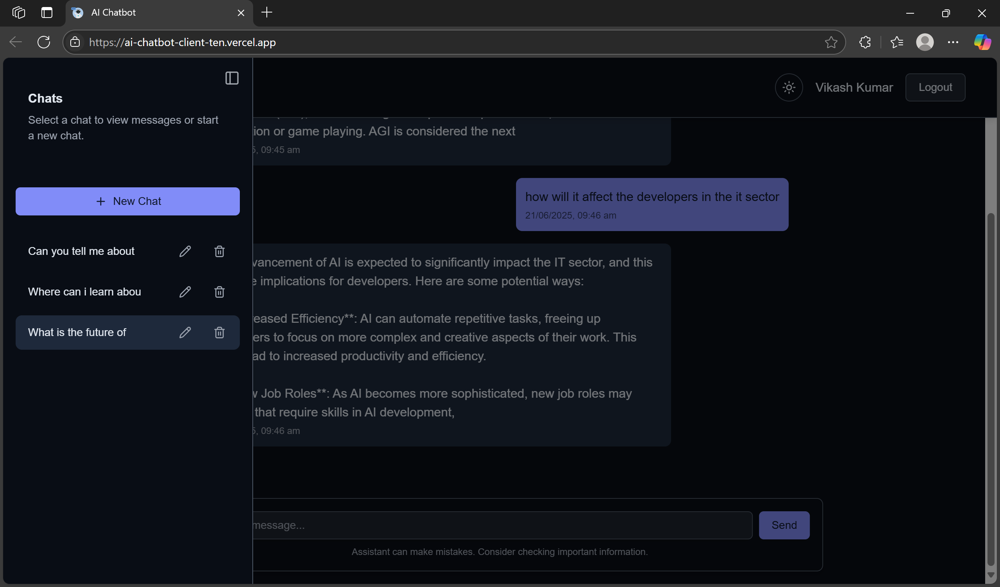
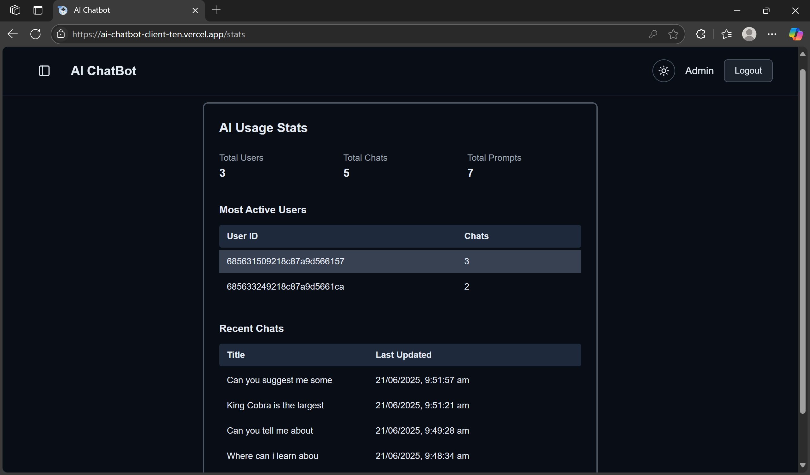

# 🤖 AI Chatbot web app
[https://ai-chatbot-client-ten.vercel.app/](https://ai-chatbot-client-ten.vercel.app/)

A full-stack AI cahtbot web app simillar to chatgpt built with modern technologies, real time interactions and OpenRouter based AI model which can easily be swapped with any other model.

## 🖼️ Preview







## ✨ Features
🔐 User Authentication

💬 Chat interface with contextual conversation

📚 Chat history saved and rename any chat

⚡Real time updates

📈Admin panel for monitoring

🤝OpenRouter integration for multi model integration

## 🛠️ Tech stack
### Frontend
React

Tailwind CSS

shadcn ui

React Router

Axios
### Backend
Node.js

Express

MongoDB

JWT for authentication

OpenRouter API for AI responses

## 🚀 Getting started
For backend visit [https://github.com/Anuptigga/AI-chatbot-api.git](https://github.com/Anuptigga/AI-chatbot-api.git)
### Clone the repository 
``` git clone https://github.com/Anuptigga/AI-chatbot-client.git```
### Install necessary packages
```bash
cd client
npm i
```
### Setup .env file
To run this project, you will need to add the following environment variables to your .env file

`VITE_API_URL`

### Start the server
```npm run dev```
